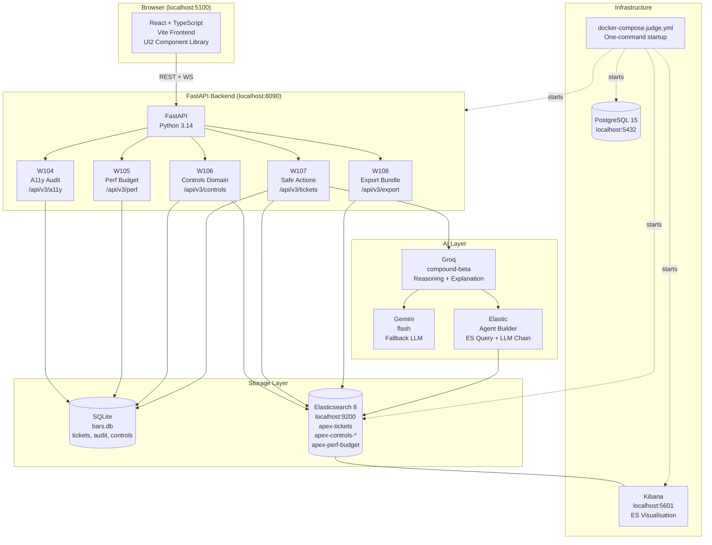
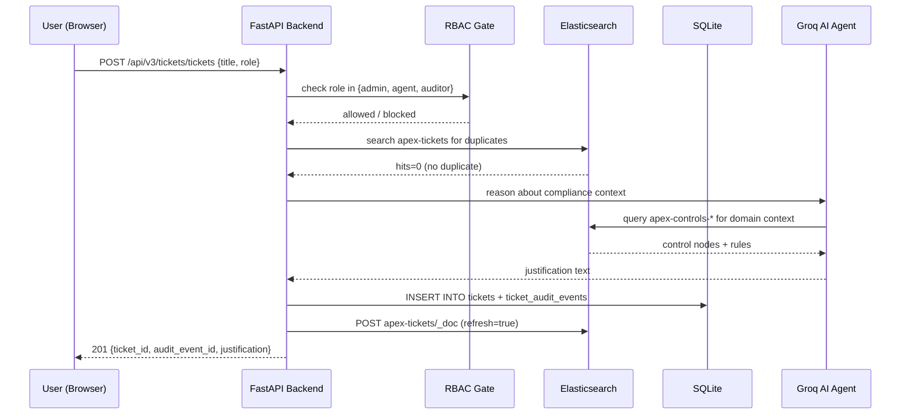
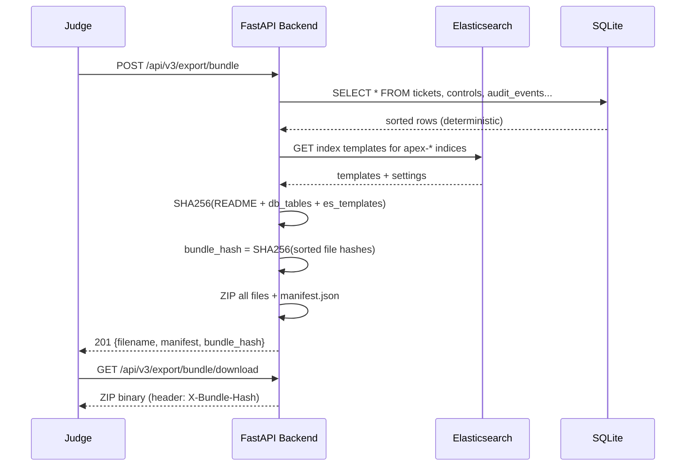

# Apex Terminal — Architecture

## System Architecture

## Data Flow: Safe Action (Key Demo)

## Export Bundle Flow

## Key Design Decisions

| Decision | Rationale |
|----------|-----------|
| SQLite + ES dual-write | SQLite for ACID durability; ES for real-time search |
| `refresh=true` on ES writes | Test determinism without sleep() |
| Deterministic export bundle | Judges can verify integrity without trusting timestamps |
| RBAC via request header | Stateless, testable, auditable |
| `data-testid` only in E2E | Resistant to UI refactors; MCP-compliant |
